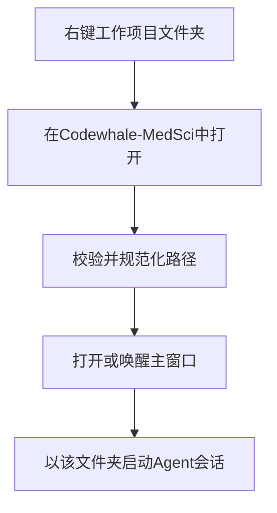
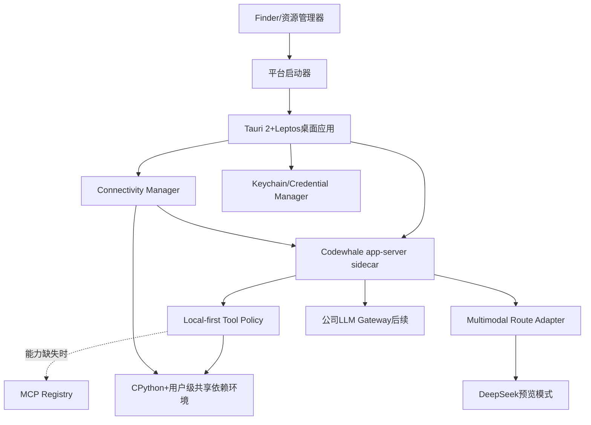

# Codewhale-MedSci Desktop 预览版规格说明

|项目|内容|
|---|---|
|文档版本|0.4|
|产品阶段|Preview|
|目标平台|Windows 10/11 x64、macOS 13及以上 arm64/x86_64|
|底层Agent|Codewhale-MedSci|
|桌面技术|Tauri 2+Leptos，UI与桌面核心以Rust为主|
|默认模型接入|用户自备DeepSeek API密钥|
|后续目标|接入公司认证、LLM路由与用量审计|
|本次源码核对基线|Codewhale v0.9.12、Codewhale-MedSci `e9b761c`、上游Codewhale `531cddb`（核对日期：2026-09-18）|

## 1.产品定义

Codewhale-MedSci Desktop是一款面向公司内部文书与学术工作的桌面Agent。用户不需要先打开终端或选择工作目录，而是在Windows文件资源管理器或macOS Finder中对一个工作项目文件夹点击右键，选择“在Codewhale-MedSci中打开”，应用即以该文件夹为当前工作区，直接进入主交互界面。

预览版用于验证四件事：

1.文件夹右键启动到Agent交互的完整路径可用。
2.简约GUI能够稳定承载流式回复、工具调用、审批和停止任务。
3.用户可以安全保存自己的DeepSeek API密钥，并使用所有工作区共享、可持续扩展依赖的内置Python环境完成常见文档任务。
4.Agent优先复用本地能力，并能通过官方DeepSeek Flash接口直接理解图片而不产生无图伪回答。

预览版不依赖公司后端。公司账号登录在界面和代码中保留完整边界，但正式身份校验、统一LLM路由和员工用量审计在后续企业版接入。

## 2.已确定的产品决策

|主题|决定|
|---|---|
|Agent底座|Codewhale-MedSci作为随应用分发的sidecar，不解析TUI文本|
|Agent通信|优先使用app-server的stdio JSON-RPC结构化协议|
|GUI形态|单窗口、单工作区、无侧边栏，视觉参考终端版的简洁布局，但不是终端模拟器|
|启动入口|Windows资源管理器和macOS Finder的文件夹右键菜单|
|未登录行为|仍可进入主界面；预览版可用个人DeepSeek密钥发送任务|
|登录入口|右下角状态栏显示身份状态，未登录时可弹出账号密码面板|
|密钥存储|macOS Keychain、Windows Credential Manager，不写入普通配置文件|
|默认权限|仅允许Agent在当前工作区内读写；危险操作和越界操作必须审批|
|Python|应用携带只读CPython与离线安装源；所有第三方依赖安装到当前系统用户唯一的共享环境，全部工作区共用|
|OCR|预装RapidOCR与ONNX Runtime CPU版及中英文模型，全程本地运行，不依赖GPU|
|网络|默认“自动：直连优先”；直连受阻时解析系统代理、PAC和代理环境变量后回退|
|工具选择|默认`local_first`：先使用已加载工具、共享Python依赖和项目自带工具；Registry仅在本地能力明确不足时作为回退|
|DeepSeek视觉|新配置使用官方规范模型名`deepseek-flash`；旧`deepseek-v4-flash`和`deepseek-v4-flash-vision-exp`仅作为迁移输入，在官方端点归一化到当前Flash视觉路由|
|更新策略|Codewhale sidecar不自行更新，由桌面应用统一升级并锁定兼容版本|
|企业化路径|以适配器接入公司Auth、LLM Gateway和Audit，不重写GUI与Agent核心|

## 3.范围

### 3.1预览版必须包含

- Windows和macOS安装包。
- 文件夹右键菜单“在Codewhale-MedSci中打开”。
- 从右键入口启动、聚焦或切换当前工作区。
- 主对话界面、流式输出、停止生成、错误重试。
- Markdown、代码块、表格和链接的安全渲染。
- 工具调用状态、结果摘要以及需要用户决定时的审批卡片。
- DeepSeek API密钥录入、连接测试、修改和删除。
- Provider、模型、权限模式、网络路径、Agent状态和登录状态的底部状态栏。
- 右下角账号密码弹窗及登录状态机；预览包不假装完成真实公司认证。
- 对话恢复、Agent异常退出检测和一键重启。
- 内置Python及指定办公文档依赖。
- Agent按需扩展用户级共享Python环境的审批流程、全局依赖锁、事务更新和恢复机制。
- 基于RapidOCR与ONNX Runtime CPU版的离线中英文OCR能力。
- 面向DeepSeek、资源下载和Python包索引的直连探测、系统代理发现与自动回退。
- 本地能力优先的工具选择策略、Registry回退门禁和可审计的选择原因。
- DeepSeek Flash原生图片输入、模型别名迁移、视觉能力标识与多模态回归测试。
- 本地诊断日志和可复制的脱敏错误信息。

### 3.2预览版明确不包含

- 公司账号的真实服务器校验。
- 公司统一API密钥、模型路由、配额和员工用量审计。
- 云端对话同步、多人共享、管理后台。
- 插件商店或普通用户自行安装系统级依赖。Agent新增Python包只安装到应用管理的用户级共享环境。
- 同一台电脑同一系统用户下为不同工作区维护多个Python环境或多套互相冲突的依赖版本。
- 为任意源码包内置完整C/C++、Fortran或系统库编译环境；预览版优先安装兼容的二进制wheel。
- 多工作区并行窗口、完整会话列表侧栏。
- 自动更新服务。预览版采用人工下载新安装包升级。
- 对个人DeepSeek调用费用的报销、预算或审计承诺。
- 把OCR结果伪装成模型已完成通用视觉理解；OCR仅负责文字提取，不能替代图表、照片或版式的原生视觉分析。

## 4.核心用户体验

### 4.1从文件夹启动



启动规则：

1.目标必须是存在且可访问的文件夹；符号链接解析为规范路径。
2.应用未运行时，启动主进程并传入绝对路径。
3.应用已运行且路径相同时，只聚焦现有窗口，不重复启动Agent。
4.应用已运行但路径不同时：若当前无执行中任务，直接切换；若有执行中任务，弹出“停止并切换/取消”。
5.预览版仅维护一个活动工作区。多窗口和并行工作区留到后续版本。
6.右键动作本身视为用户主动选择工作区，不再增加阻塞式欢迎页。

应用同时保留“文件→打开文件夹”和启动器图标入口。未指定文件夹时显示一个极简空状态，提示用户选择文件夹，不自动使用用户主目录。

### 4.2主窗口布局

主窗口由四个区域组成：

|区域|内容|
|---|---|
|标题栏|当前文件夹名称、应用名称；完整路径在悬停或窗口菜单中显示|
|对话区|用户消息、Agent回复、折叠的工具调用卡片、审批卡片、错误提示|
|输入区|多行输入框、图片附件、发送/停止按钮；`Enter`发送，`Shift+Enter`换行|
|状态栏|左侧显示Provider、模型和权限模式；右侧显示网络路径、Agent状态、API状态、登录状态和问题数|

界面默认使用深色主题，并跟随系统切换浅色主题。整体借鉴参考图中的大面积内容区、底部输入框和紧凑状态栏，不复刻ANSI终端字符、更新提示或命令行噪声。参考图底部所示的Provider、模型、权限和问题状态应转化为可点击的GUI状态项，而不是纯文本。

### 4.3状态栏

推荐排列：

`DeepSeek · 当前模型 · 工作区受限`　　　　`直连 · Agent就绪 · API已配置 · 未登录 · 问题0`

交互规则：

- 点击Provider或API状态，打开API设置弹窗。
- 点击权限模式，查看当前工作区边界和本次会话的授权记录。
- 点击网络路径，查看当前使用直连、系统代理或手动代理，并可执行连接测试。
- 点击Agent状态，显示启动、重启和最近错误。
- 点击“未登录”，打开锚定于右下角的登录弹窗。
- 点击“已登录”，显示账号、会话到期时间和退出登录。
- 状态变化通过颜色和文字共同表达，不只依赖颜色。

### 4.4登录弹窗

未登录时，右下角状态为“未登录”。首次启动可自动展开一次登录弹窗，用户关闭后不反复打扰；之后点击状态项重新打开。

弹窗字段：

- 公司账号。
- 密码。
- “登录”按钮。
- 内联状态和错误区域。
- 预览版说明：“公司认证服务尚未接入，不影响使用个人DeepSeek密钥测试。”

预览版发布包中的登录按钮在未配置认证服务时返回明确的“企业登录暂未启用”，不得接受任意账号密码后伪装成功。开发构建可通过mock auth测试`登录中→已登录→令牌过期→退出`的界面状态，但mock能力不得进入发布构建。

后续接入公司认证后，账号密码仅用于当次TLS请求，密码不落盘；短期访问令牌和刷新令牌存入操作系统安全凭据库。

### 4.5个人DeepSeek配置

API设置是独立弹窗，不与账号密码混在同一个表单。字段包括：

- Provider：预览版固定为DeepSeek。
- API Base URL：提供默认值，高级选项中可修改。
- Model：新配置默认`deepseek-flash`，可手工填写兼容模型标识。
- 模型能力：在模型旁显示“视觉可用”“视觉未知”或“仅文本”，能力按Provider、Base URL、协议和实际wire model共同确定。
- API Key：密码样式输入，可保存、替换、删除，不提供明文回显。
- “测试连接”按钮。

若未配置API Key，用户仍可浏览主界面；首次发送消息时拦截请求并打开API设置。连接测试成功后显示“API已配置”，失败时保留用户输入并展示脱敏错误。

预览版的新配置默认选择官方`deepseek-flash`。读取旧配置时，只有在官方`api.deepseek.com`路由上，才把`deepseek-v4-flash`或已退役的`deepseek-v4-flash-vision-exp`迁移为`deepseek-flash`；自定义代理、聚合商和本地模型端点必须保留用户填写的原始模型ID及“能力未知”状态，不能凭名称继承官方能力。

### 4.6网络设置

点击状态栏网络路径打开轻量面板，显示：

- 当前模式和实际路径。
- 系统代理是否存在、来源是显式设置还是PAC，以及是否命中绕过规则。
- DeepSeek、Python包索引和通用下载三项连接测试。
- “自动：直连优先”“仅直连”“系统代理”“手动代理”切换。
- 手动代理地址、可选用户名和密码、绕过地址；密码不明文回显。

自动回退成功时显示一次非阻塞提示“直连不可用，已切换到系统代理”，后续请求不重复弹出。网络恢复直连后更新状态栏，不中断正在执行的安全请求。

### 4.7图片输入与视觉反馈

输入区支持通过附件按钮、拖放和粘贴加入JPEG、PNG、GIF或WebP图片。发送前显示缩略图、文件名、尺寸、大小、当前模型视觉状态和删除操作；本地绝对路径不得进入模型请求。

视觉处理规则：

1.官方DeepSeek Flash路由显示“视觉可用”，本地图片编码为data URL，通过当前协议的原生图片内容块发送。
2.用户请求“识别/提取图片文字”时，可以优先使用本地RapidOCR并明确标记结果来自OCR。
3.用户请求描述照片、判断版式、解读图表或其他通用视觉任务时，必须使用原生视觉模型，不能用OCR结果冒充看过图片。
4.当前路由为“仅文本”时阻止带图发送并提供切换模型；能力为“未知”时先显示明确风险，只有用户确认或通过视觉连接测试后才发送。
5.上游拒绝图片时，本次任务以可操作错误结束并保留附件；不得删除图片后自动重试，再让模型在未看到图片的情况下生成答案。

## 5.功能需求

### 5.1桌面与工作区

|编号|要求|验收标准|
|---|---|---|
|FR-001|从文件夹右键菜单启动|选择菜单后，主窗口在3秒内可见并显示正确文件夹名|
|FR-002|支持文件夹本身与文件夹空白处|两种入口都把目标文件夹解析为同一规范路径|
|FR-003|单实例转发|应用已运行时不创建重复后台主进程，路径事件转发给已有进程|
|FR-004|工作区边界|默认工具只能读写当前文件夹及其子目录|
|FR-005|路径安全|拒绝不存在路径、普通文件、NUL字符和无法规范化的路径，并向用户说明原因|
|FR-006|路径兼容|正确处理中文、空格、Unicode、长路径和外接磁盘路径|

### 5.2对话与Agent

|编号|要求|验收标准|
|---|---|---|
|FR-010|结构化连接|GUI通过app-server结构化事件通信，不读取或解析TUI屏幕文本|
|FR-011|流式消息|响应增量可见，界面滚动和输入不被阻塞|
|FR-012|停止任务|点击停止后向Agent发送取消；超时后终止并重启sidecar|
|FR-013|工具卡片|显示工具名称、状态、耗时、目标文件和脱敏后的结果摘要|
|FR-014|审批|写文件、执行命令或越界尝试按照策略显示允许一次、拒绝选项|
|FR-015|失败恢复|sidecar崩溃后保留会话记录，显示原因并提供重启按钮|
|FR-016|会话恢复|重启应用后恢复该工作区最近一次会话，不自动续跑未完成任务|
|FR-017|新会话|通过应用菜单或`Ctrl/Cmd+N`清空当前上下文并新建会话|

### 5.3认证、密钥与状态

|编号|要求|验收标准|
|---|---|---|
|FR-020|登录状态常驻|右下角始终显示明确的登录状态|
|FR-021|登录弹窗|未登录状态可打开账号密码表单；登录中禁止重复提交|
|FR-022|预览版真实表达|无Auth服务时不得产生虚假的已登录状态|
|FR-023|安全保存API Key|配置文件、数据库、日志和崩溃报告中均找不到明文密钥|
|FR-024|删除API Key|删除后立即停止向Agent注入密钥，并要求重新配置才能发送|
|FR-025|状态一致性|Provider、模型、API、Agent和登录状态与实际运行状态一致|

### 5.4内置办公运行环境

预览版随安装包提供独立CPython，员工电脑无需另装Python，也不要求管理员权限。同一操作系统用户只有一个Codewhale-MedSci共享Python环境，所有工作区和历史项目均使用该环境，不创建项目级虚拟环境。

运行时分为三个部分：

1.只读CPython载荷：随应用安装，只包含解释器、标准库和初始化共享环境所需的最小工具。
2.离线安装源：安装包携带首批依赖的锁文件、wheel和OCR模型，首次初始化不访问互联网。
3.用户级共享环境：首次运行时在用户应用数据目录创建，所有内置第三方依赖和后续新增依赖都安装到这里；它是唯一对Agent生效的`site-packages`。

首批共享依赖：

- Word：`python-docx`
- PowerPoint：`python-pptx`
- Excel与数据：`pandas`、`openpyxl`
- PDF：`PyMuPDF`、`pypdf`、`reportlab`
- 图片与绘图：`Pillow`、`matplotlib`
- 基础计算：`numpy`
- HTML/XML：`beautifulsoup4`、`lxml`
- OCR：`rapidocr`、CPU版`onnxruntime`及其锁定的最小运行依赖
- OCR模型：面向中英文和数字的文本检测、方向分类、文本识别ONNX模型

运行要求：

- 每个系统和CPU架构单独构建、锁定版本并校验哈希。
- 不在应用包、`Program Files`、系统Python或工作项目目录中安装第三方依赖。
- Windows共享环境默认位置为`%LOCALAPPDATA%\Codewhale-MedSci\python\shared\current\`。
- macOS共享环境默认位置为`~/Library/Application Support/Codewhale-MedSci/python/shared/current/`。
- 同一系统用户的所有工作区均解析到上述同一个`current`环境；不允许按工作区路径生成其他环境。
- 对普通Agent工具，共享环境只读；只有Runtime Manager的依赖安装事务可以写入，避免脚本绕过审批直接修改库文件。
- 首次初始化在用户目录创建暂存环境，安装全部离线依赖并完成校验后再原子切换为`current`。暂存和回滚副本不对Agent可见，并在成功后清理。
- 共享环境清单至少记录Python主次版本、平台、CPU架构、基础锁版本、已安装包、模型版本和文件哈希。
- 启动sidecar时将共享环境的`bin`或`Scripts`置于`PATH`首位，并设置`VIRTUAL_ENV`和`PYTHONNOUSERSITE=1`，隔离系统与用户全局Python包。
- Runtime Manager为Agent提供稳定的`python`、`python3`、`pip`和`pip3`入口；它们全部指向共享环境，其中pip入口转交受控安装器。
- 不要求执行激活脚本；Runtime Manager始终使用虚拟环境解释器的绝对路径。
- Agent生成的脚本和结果写入当前工作区，不写入应用安装目录。
- 应用升级导致Python ABI或基础锁变化时，根据统一依赖清单在暂存目录重建一次共享环境；验证成功后原子替换`current`，不原地升级不兼容环境。
- 设置页只显示一个“共享Python环境”，可查看空间、全部包、模型和变更历史，并执行修复、重建或清理缓存。
- 发布前对DOCX、PPTX、XLSX和PDF各执行一次创建、读取、修改的冒烟测试。

#### 5.4.1按需安装依赖

Agent需要新依赖时，优先调用应用提供的`medsci-python install`受控工具。命令策略捕获`pip`、`pip3`和`python -m pip`安装操作并转交受控安装器，目标只能是唯一共享环境，不能回退到系统Python、普通用户`site-packages`或项目目录。

安装流程：

1.Agent提出包名、版本约束、用途和来源。
2.安装器取得跨进程全局锁，确保多个Agent任务不能同时修改共享环境。
3.界面显示安装审批卡片，明确提示“此变更影响所有工作区”，并列出索引、版本变化、被替换的既有包和是否需要源码构建。
4.用户允许后先在暂存环境解析并安装依赖，默认优先使用与当前平台和Python ABI匹配的wheel。
5.安装完成后运行`pip check`、目标模块导入测试、核心办公依赖测试和OCR自检。
6.验证成功后更新统一依赖锁并原子切换；所有工作区后续启动的Python任务立即使用新版本。
7.失败时保留现有`current`不变，展示可操作原因，不留下半安装状态。

依赖安装规则：

- 不调用`sudo`、UAC提权、全局`pip`、`--user`或系统包管理器。
- 包缓存放在用户可写的应用缓存目录，所有工作区复用已验证wheel。
- 共享环境任一时刻只允许一个写事务；Python读取任务可继续使用当前已验证版本，切换发生在事务完成后。
- 请求的版本与现有包冲突时，不创建第二个项目环境。安装器必须展示冲突链，并让用户选择取消或对所有工作区执行兼容的全局版本变更。
- 对RapidOCR、ONNX Runtime及核心办公依赖的升级或删除标记为高影响变更，需额外确认并通过完整冒烟测试。
- 二进制wheel可在一次普通审批后安装；只有源码分发包时追加高风险说明，因为构建过程可能执行第三方代码。
- 需要系统编译器、系统动态库或内核驱动的包可能无法在预览版自动完成；这类失败必须明确指出缺失项，不得尝试绕过操作系统安全策略。
- 企业版可通过签名策略配置允许索引、包允许列表、禁用列表、版本上限和哈希锁定。

#### 5.4.2内置OCR

默认OCR采用RapidOCR和ONNX Runtime CPU版。选择理由是其开源、支持离线部署、默认支持中英文，并可用ONNX Runtime在CPU上运行；预览版不得安装`onnxruntime-gpu`、CUDA、PyTorch或完整Paddle训练框架。

OCR能力要求：

- 默认支持简体中文、英文、数字和中英文混排；其他语言通过后续模型包扩展，但仍安装到同一个共享环境。
- 安装包内置锁定版本的检测、方向分类和识别模型，首次调用不联网下载模型。
- 支持PNG、JPEG、TIFF等常见图片；PDF通过PyMuPDF按页渲染后识别。
- 输出纯文本以及包含页码、文本框坐标、置信度和阅读顺序的结构化JSON，可供Agent进一步生成Markdown、Word或可搜索PDF。
- OCR默认完全本地执行，图片、PDF页面和识别结果不上传到模型服务。
- OCR模型、代码和转换产物的许可证、来源、版本与SHA-256写入SBOM和第三方声明。
- 对扫描质量较差、旋转、倾斜和低置信度内容保留原置信度，不让Agent把不确定结果描述为确定事实。
- 发布构建在Windows x64、macOS arm64和macOS x86_64分别验证CPU执行提供程序，不得因系统存在GPU而自动拉取GPU依赖。

性能目标以统一参考图片和硬件基线测量：预热后A4 200 DPI中英文混排页面的单页识别中位数目标不高于3秒，OCR新增安装体积目标不高于250MB，单次识别的额外峰值内存目标不高于500MB。发布报告必须记录实际值，未达标时不得以GPU作为补救前提。

|编号|要求|验收标准|
|---|---|---|
|FR-030|用户级共享环境|普通用户首次使用时可在用户应用数据目录完成离线初始化，不触发提权|
|FR-031|跨工作区共享|在工作区A安装新包后，工作区B无需再次安装即可导入同一包和版本|
|FR-032|安装来源可见|审批卡片明确显示包、版本约束、索引、wheel或源码构建|
|FR-033|全局冲突处理|不创建第二套环境；冲突时展示依赖链并阻止未经确认的全局替换|
|FR-034|事务与恢复|安装失败时当前共享环境保持不变，成功环境通过`pip check`和核心冒烟测试|
|FR-035|升级兼容|Python ABI或基础锁变化后重建唯一共享环境，不复用不兼容二进制包|
|FR-036|CPU OCR|离线识别中英文图片和扫描PDF，不安装或调用任何GPU运行时|

### 5.5网络连接与代理回退

默认网络模式为“自动：直连优先”。应用不通过扫描进程名、读取其他应用私有文件或探测一组猜测端口来识别代理软件，而是读取代理软件向操作系统或当前进程正式注册的网络配置。

支持四种模式：

|模式|行为|
|---|---|
|自动：直连优先|先对实际目标进行短超时直连探测；仅在网络层失败时解析系统代理并重试|
|仅直连|禁用显式代理回退；TUN/VPN造成的系统路由仍由操作系统处理|
|系统代理|直接按目标URL解析系统代理、PAC/WPAD及绕过规则|
|手动代理|使用用户明确填写的HTTP、HTTPS或SOCKS5代理；凭据存入安全凭据库|

#### 5.5.1代理发现

发现顺序和来源：

1.应用内手动代理，仅在用户选择“手动代理”时启用。
2.当前目标URL对应的操作系统代理设置和PAC结果。
3.`HTTPS_PROXY`、`HTTP_PROXY`、`ALL_PROXY`及其小写形式。
4.`NO_PROXY`及系统绕过列表始终优先，命中时不得强制走代理。

Windows通过WinHTTP读取当前用户活动连接的显式代理、自动发现和PAC配置，并针对每个目标URL解析结果。macOS通过System Configuration/CFNetwork读取当前网络服务的HTTP、HTTPS、SOCKS和PAC配置，并监听系统代理变更。代理仅以本机监听但未写入系统设置、环境变量或应用设置时，应用无法可靠判断其用途，应在网络设置中提示用户选择“手动代理”。

#### 5.5.2直连失败判定

允许触发代理回退的情况：

- DNS解析失败。
- 连接超时、拒绝、网络不可达或连接被重置。
- TLS隧道建立前的网络失败。
- 已确认的代理认证需求或PAC指示。

HTTP 400、401、403、404、409、429和普通5xx不代表“需要代理”，不得仅因这些响应自动换路。证书校验失败也不得通过关闭TLS校验解决；应用继续使用操作系统信任库，并在企业版允许管理员配置额外CA。

#### 5.5.3请求与重试安全

- DeepSeek/API连接测试、Python索引访问和资源下载必须使用实际目标域名探测，不能用无关公共网站代替。
- GET、HEAD和可断点下载可在直连明确失败后通过代理重试。
- LLM POST在发送前完成路由探测。只有能够证明请求正文尚未发送，或服务端支持幂等键时，才允许自动换路重试，避免重复计费和重复任务。
- 成功路径按`scheme+host+port+网络标识`缓存，默认5分钟；网络或代理设置变化时立即失效。
- 当前网络路径显示为“直连”“系统代理”“手动代理”或“网络不可用”，并记录不含主机凭据的诊断原因。

#### 5.5.4统一出口

Connectivity Manager必须把同一网络策略应用到：

- Rust Core发起的API请求和资源下载。
- Codewhale sidecar的模型请求。
- `medsci-python install`、pip索引和wheel下载。
- Agent使用的受控资源下载工具。

当选择代理路径时，Rust HTTP客户端显式设置代理；sidecar和受控子进程获得临时的`HTTP_PROXY`、`HTTPS_PROXY`、`ALL_PROXY`和`NO_PROXY`环境。直连模式下这些变量必须从受控子进程环境中移除，避免继承宿主的意外代理。系统代理发生变化后，应用更新连接池；如果Codewhale无法动态更新代理环境，则在当前任务结束后受控重启sidecar。

Python包安装由`medsci-python`包装器执行两阶段尝试：先在无显式代理环境中直连，符合回退条件时再注入已解析代理并重试。Agent系统提示中必须明确要求依赖安装和通用下载使用受控工具，不能把代理地址或认证信息写入脚本。

|编号|要求|验收标准|
|---|---|---|
|FR-040|直连优先|无代理且目标可达时不经过显式代理，状态栏显示“直连”|
|FR-041|系统代理回退|阻断直连并配置系统代理或PAC后，目标请求自动改走解析结果|
|FR-042|统一网络策略|LLM请求、受控下载和Python包安装得到一致的代理与绕过规则|
|FR-043|安全重试|已获得HTTP响应的错误不误判为代理问题，非幂等请求不重复提交|
|FR-044|动态变更|切换代理软件或网络后缓存失效，下一请求使用新路径|
|FR-045|凭据保护|日志、错误、环境诊断和UI中不出现代理密码或带凭据URL|

### 5.6本地优先的工具选择与Registry回退

Codewhale v0.9.12在每个启用MCP的会话中注入强制性的“Registry-first”系统指令，要求专业任务在本地程序、自定义代码或手工实现之前调用`registry_sync`。后续源码已把文案改成“缺失能力时回退”，但Registry说明仍在MCP启用时进入首个模型请求，而且执行层没有验证本地共享环境是否已经具备相同能力。因此预览版不能只依赖提示词纠偏，必须由桌面宿主和sidecar共同执行本地优先策略。

工具解析顺序：

|层级|候选能力|选择规则|
|---|---|---|
|L1|已加载的内置工具、共享Python环境中的包/命令、当前工作区自带脚本与测试工具|能满足任务时直接使用，不发起Registry请求|
|L2|尚未安装但可通过`medsci-python install`加入唯一共享环境的Python依赖|说明用途并完成全局影响审批后安装；安装成功即回到L1|
|L3|已由用户配置并已连接的本地MCP工具|只有在比L1更适合任务或用户明确指定时使用|
|R1|MCP Registry发现并启动的新服务器|仅在已识别出具体缺失能力、L1/L2/L3都不能合理满足，或用户明确要求查找Registry时使用|

实现要求：

- Runtime Manager维护有界的“本地能力索引”，包含内置工具、共享环境的Python发行包与版本、`console_scripts`入口、OCR/办公能力标签，以及工作区内已授权的项目工具。索引不执行任意导入，不扫描工作区外目录。
- 模型首轮只接收短小的能力摘要和一个可查询的本地能力工具，不把完整`pip freeze`塞入系统提示。依赖安装、修复或环境原子切换后使索引失效，并在下一步工具选择前刷新。
- 桌面发行构建删除v0.9.12的强制Registry-first指令；`mcp-discovery`升级为显式回退技能。对Codewhale曾自动安装且内容未被用户修改的旧技能执行安全迁移；用户修改过的技能不覆盖，但产品级工具策略仍优先于技能文案。
- `registry_sync`和`start_registry_mcp_server`保持deferred，不进入初始工具目录头部。Registry名称、描述或工具数组中的排列顺序不得直接提高选择优先级。
- Registry调用前生成结构化决策：`missing_capability`、已命中的本地候选、未采用原因和是否由用户明确要求。若有足够的本地候选且没有用户明确要求，执行层拒绝Registry调用并返回建议的本地能力。
- “本地优先”不等于任意执行Shell。所有本地工具仍受工作区、审批、网络和依赖安装策略约束；依赖环境可用也不扩大文件访问范围。
- Registry包仍视为新增第三方代码。启动前显示来源、精确包标识、运行时、参数和权限，并要求用户审批；不得以Registry回退规避`medsci-python`的依赖审查。
- 用户明确说“用Registry/MCP查找工具”时可直接进入R1，但仍执行安全审批。用户明确要求离线或禁用Registry时，本会话不得访问Registry网络端点。
- 每次工具决策记录本地诊断收据：选择来源、候选ID、策略层级和回退原因；不记录消息正文、文档内容、凭据或完整外部响应。

|编号|要求|验收标准|
|---|---|---|
|FR-050|本地能力优先|对DOCX、PPTX、XLSX、PDF、图片处理和OCR任务，已有共享依赖可完成时不调用`registry_sync`|
|FR-051|本地能力索引|启动后可查询共享环境的包、版本、入口与能力标签；安装事务完成后索引在下一次选择前更新|
|FR-052|Registry门禁|非用户显式请求的Registry调用必须携带缺失能力与本地候选判定；本地能力足够时执行层拒绝调用|
|FR-053|本地扩展优先|缺少普通Python能力时优先建议受控安装到唯一共享环境，而不是搜索或启动MCP服务器|
|FR-054|显式用户覆盖|用户明确要求Registry时可以搜索，但启动第三方服务器仍需审批|
|FR-055|选择收据|诊断视图能说明一次任务为何使用本地工具、安装依赖、已连接MCP或Registry回退|
|FR-056|旧策略迁移|从v0.9.12升级后，首轮系统提示和自动安装技能中不再存在“必须先调用Registry”的规则|

### 5.7DeepSeek Flash原生视觉兼容

官方DeepSeek文档当前以`deepseek-flash`作为支持图片的规范模型名：Chat Completions使用`content`数组中的`image_url`块，Responses API使用`input_image`块。官方同时说明`deepseek-v4-flash-vision-exp`已经退役，但旧名称仍被接受并由最新Flash模型处理。

源码核对显示，Codewhale的两种请求编码器已经具备正确的图片结构；故障发生在编码之前：DeepSeek普通Flash路由及离线模型目录把`image_input`或`modalities`标记为不支持图片，`Engine::run_turn`据此在发送前把图片块替换成文字。实验视觉模型被单独标为`Supported`，所以只有该模型能看到图片。修复应集中在模型归一化、精确路由能力和回归测试，不应另建一套图片上传通道。

模型与路由规则：

|用户或旧配置中的模型ID|官方DeepSeek端点的有效wire model|视觉状态|说明|
|---|---|---|---|
|`deepseek-flash`|`deepseek-flash`|支持|新配置默认值，优先走Responses API|
|`deepseek-v4-flash`|`deepseek-flash`|支持|兼容迁移别名；只在官方端点归一化|
|`deepseek-v4-flash-vision-exp`|`deepseek-flash`|支持|已退役兼容别名；模型选择器不再推荐为新选项|
|`deepseek-v4-pro`|保持原ID|仅文本，除非官方以后明确声明|不得从Flash能力推断|
|相同名称但自定义Base URL/聚合商/本地端点|保持原ID|未知或由该端点目录明确声明|不得继承官方DeepSeek能力|

协议要求：

- 官方Responses路由把文本编码为`input_text`、图片编码为`input_image`，`image_url`值为HTTP(S) URL、data URL或对应的`file_id`字段；本地文件默认使用data URL，不上传本地路径。
- 官方Chat Completions路由把用户消息`content`编码为数组，包含`{"type":"text"}`和`{"type":"image_url","image_url":{"url":"..."}}`。
- 支持JPEG、PNG、GIF和WebP，并在本地校验真实文件类型。遵守官方请求体、单图、总大小、数量和尺寸限制；预览版可以采用更小的产品上限，但必须在发送前显示明确错误。
- 图片只出现在官方允许的用户/开发者消息或工具结果位置。系统消息和助手历史中的非法图片必须在本地拒绝，不能等待服务端400。
- 能力由`Provider + 标准化Base URL + wire model + protocol`共同决定。官方能力表、实时模型目录与用户覆盖的优先关系必须确定且可诊断；自定义端点默认`Unknown`。
- 请求日志只记录图片数量、格式、尺寸、字节数、协议和内容哈希前缀，不记录base64、远程签名URL、文件名中的敏感内容或原始图像。
- 当服务端明确拒绝图片时，把该精确路由在当前会话标记为不可用并终止本次视觉任务。不得沿用现有的“剥离图片并自动重发”行为；切换模型或使用本地OCR必须由用户可见地决定。
- 本地OCR与原生视觉是两种独立能力。仅当任务目标是文字提取，或用户确认降级为OCR时，才可把RapidOCR结果提供给模型，并在消息中标明来源与置信度。

建议的最小源码修复面：

- `crates/config/src/route/offering.rs`：为官方`deepseek-flash`建立独立的`image_input=Supported`能力行，并把旧Flash选择器映射到规范wire model；不要把Pro共用的`Unsupported`结构体扩散给Flash。
- `crates/config/assets/models_dev.bundled.json`和`crates/models/assets/model_catalog.bundled.json`：把官方`deepseek-flash`输入模态更新为`text + image`，并把旧ID表达为别名而非独立的仅文本能力事实。
- `crates/tui/src/config/models.rs`、`crates/agent/src/lib.rs`和路由解析测试：限定别名归一化只发生在官方DeepSeek路由，自定义端点保持原样。
- `crates/tui/src/client/responses.rs`与`crates/tui/src/client/chat.rs`：复用现有编码器，分别增加`deepseek-flash`的`input_image`和`image_url`契约测试。
- `crates/tui/src/core/engine/turn_loop.rs`、Runtime API和`read_media`测试：证明支持视觉的精确路由不会剥离图片，服务端拒绝时不会无图重发，模型目录向GUI报告`image_input=supported`。

|编号|要求|验收标准|
|---|---|---|
|FR-060|规范模型迁移|官方端点的新配置使用`deepseek-flash`；两个旧Flash ID可无损迁移且不改变自定义端点模型ID|
|FR-061|精确视觉能力|官方`deepseek-flash`在模型目录、Runtime API、模型选择器和执行路由中一致报告`image_input=supported`|
|FR-062|原生图片请求|同一测试图片在Responses与Chat两种官方协议中分别生成规范的`input_image`和`image_url`内容块|
|FR-063|禁止无图静默重试|视觉请求被服务端拒绝时，捕获的后续请求数为0，UI保留附件并显示切换模型或OCR选项|
|FR-064|端点能力隔离|自定义Base URL即使使用相同模型名也不自动获得官方视觉能力，除非其可信目录或用户配置明确声明|
|FR-065|视觉与OCR分离|通用看图任务不能走OCR降级；文字提取任务使用OCR时明确显示本地处理和置信度|
|FR-066|多模态回归矩阵|PNG/JPEG、中文截图、自然图片、图表、用户附件和工具返回图片在流式/非流式路径均通过测试|

## 6.状态模型

### 6.1身份状态

|状态|右下角显示|弹窗行为|能否使用个人DeepSeek|
|---|---|---|---|
|认证未配置|未登录|显示表单及“企业登录暂未启用”|可以|
|已退出|未登录|允许输入账号密码|可以，企业策略启用前|
|登录中|登录中|禁用重复提交，可取消|可以，预览版|
|已登录|账号名或“已登录”|显示账号、到期时间、退出|可以或按企业策略禁用|
|令牌过期|登录已过期|要求重新登录|由企业策略决定|
|离线|离线|保留表单，显示网络错误|已配置的个人API仍按网络情况使用|

### 6.2Agent状态

`未启动→启动中→就绪→执行中→取消中→就绪`

异常分支为`启动失败`或`已崩溃`。所有异常必须有用户可理解的说明、脱敏详情和“重启Agent”操作。

### 6.3网络状态

`探测中→直连可用`或`探测中→直连失败→解析代理→代理可用`。

失败分支为`系统未配置代理`、`PAC解析失败`、`代理认证失败`和`网络不可用`。状态栏只显示简洁结果，详情面板显示目标、失败阶段、代理来源和脱敏错误，不显示代理密码或完整带凭据URL。

## 7.技术架构



### 7.1组件职责

|组件|职责|
|---|---|
|Leptos UI|消息渲染、输入、弹窗、状态栏、审批交互|
|Tauri Rust Core|窗口生命周期、受控命令、密钥访问、单实例、平台启动事件|
|Agent Supervisor|启动/停止sidecar、协议适配、事件归一化、崩溃恢复|
|Codewhale sidecar|推理编排、工具调用、文件与命令任务|
|Platform Integration|Windows Shell命令、macOS Finder扩展、安装/卸载清理|
|Runtime Manager|选择对应架构的Codewhale与CPython，初始化唯一共享环境并管理全局依赖锁和OCR模型|
|Local-first Tool Policy|构建本地能力索引、执行工具优先级、门禁Registry并生成选择收据|
|Connectivity Manager|直连探测、系统代理/PAC解析、路径缓存、回退和子进程网络环境|
|Auth Adapter|预览版禁用或mock，后续连接公司认证|
|LLM Route Adapter|预览版个人DeepSeek，后续切换公司Gateway；按精确路由解析协议与模型能力|
|Multimodal Route Adapter|验证图片、生成协议对应内容块、维护视觉能力状态并阻止无图静默重试|

### 7.2推荐仓库结构

```text
Codewhale-MedSci-Desktop/
├── apps/
│   └── desktop/
│       ├── src-tauri/
│       └── ui/
├── crates/
│   ├── agent-adapter/
│   ├── auth-adapter/
│   ├── config/
│   ├── connectivity-manager/
│   ├── shared-python-manager/
│   ├── tool-policy/
│   ├── multimodal-route/
│   ├── project-launcher/
│   └── secure-store/
├── platform/
│   ├── macos-finder-extension/
│   └── windows-explorer-command/
├── runtime/
│   ├── codewhale/
│   └── python/
│       ├── cpython/
│       ├── wheelhouse/
│       └── ocr-models/
├── packaging/
│   ├── macos/
│   └── windows/
└── tests/
    ├── contract/
    ├── e2e/
    ├── document-smoke/
    ├── ocr-smoke/
    ├── tool-policy/
    ├── multimodal-contract/
    └── network-proxy/
```

Codewhale-MedSci保持为独立上游跟踪目录或构建依赖。公司专有逻辑不得散落修改Agent核心，必要变更先在`agent-adapter`中吸收。

### 7.3Agent进程契约

目标启动形态为：

```text
codewhale app-server --stdio
cwd=<canonical_project_path>
```

实际命令参数以锁定的Codewhale-MedSci提交所提供的协议为准。适配层必须完成协议握手和版本检查；协议不兼容时阻止运行并给出明确版本错误。

sidecar输入环境只包含必需项：

- DeepSeek凭据，由Rust Core从安全凭据库读取并只注入子进程。
- 当前系统用户唯一共享Python环境的`PATH`和相关隔离变量。
- Connectivity Manager为当前目标选出的网络路径和临时代理环境。
- 当前工作区路径。
- 应用生成的会话和日志目录。

不得把完整宿主环境、无关企业凭据或渲染层可读取的密钥传给sidecar。

### 7.4内部事件模型

UI只消费归一化事件，不直接依赖Codewhale协议字段：

```text
SessionStarted
MessageDelta
MessageCompleted
ToolStarted
ToolOutputDelta
ToolCompleted
ToolDecisionRecorded
ApprovalRequested
UsageUpdated
ModelCapabilityUpdated
ImageAttachmentRejected
AgentError
SessionEnded
```

这样后续升级Codewhale协议时只修改适配层。

## 8.平台集成

### 8.1Windows

- 支持对选中的文件夹和文件夹背景执行“在Codewhale-MedSci中打开”。
- Windows 11优先采用`IExplorerCommand`和带身份的包注册，使命令出现在新版一级右键菜单。
- Windows 10可复用命令实现或提供兼容的Shell verb。
- Shell扩展只负责取得路径并唤醒轻量启动器，不在Explorer进程中启动Agent或进行网络请求。
- 安装和卸载必须成对注册、清理菜单项，不残留失效入口。
- 预览版交付签名的x64安装包；企业部署阶段再补充集中分发策略。

### 8.2macOS

- 使用随应用签名的Finder Sync扩展提供“在Codewhale-MedSci中打开”。
- 扩展只负责接收所选文件夹URL并转交主应用，不承载Agent逻辑。
- 首次安装若系统要求用户启用Finder扩展，应用提供一次性引导和“打开系统设置”。
- 支持用户主目录下的普通项目和已挂载的数据卷；对受系统隐私保护的目录遵循macOS授权结果。
- GUI与桌面核心使用Rust；Finder扩展允许使用最小量Swift/Objective-C作为平台桥接代码。
- 分别提供arm64和x86_64签名、公证DMG，避免把两套大型Python二进制强行合并为超大Universal包。

### 8.3跨平台启动协议

平台启动器向已运行主进程发送：

```json
{
  "version": 1,
  "action": "open_project",
  "path": "<absolute path>",
  "source": "explorer_context_menu|finder_context_menu|in_app_picker"
}
```

主进程收到后重新规范化并校验路径，不能信任Shell扩展传来的原始字符串。进程间通信仅允许本机当前用户访问。

## 9.本地数据与配置

|数据|存储位置|说明|
|---|---|---|
|API Key|Keychain或Credential Manager|只存密钥，不写普通文件|
|公司令牌|Keychain或Credential Manager|企业版启用，密码永不保存|
|非敏感设置|应用数据目录中的版本化配置|主题、模型、Base URL、最近工作区|
|会话|应用数据目录中的SQLite|按规范化路径哈希分区，不污染工作文件夹|
|共享Python环境|用户应用数据目录|同一系统用户唯一，所有工作区共用；可从统一依赖锁重建|
|OCR模型|共享Python数据目录|离线中英文ONNX模型，按版本和哈希校验|
|统一依赖锁与wheel缓存|用户应用数据/缓存目录|锁文件长期保留；缓存可清理且不得含索引凭据|
|本地能力索引|应用缓存目录|由共享环境和工作区授权内容重建；不作为依赖真相源，可安全删除|
|手动代理凭据|Keychain或Credential Manager|代理地址可写非敏感配置，用户名和密码分离保存|
|日志|应用日志目录|结构化、滚动、默认保留7天、严格脱敏|
|生成文件|当前工作区|由用户任务和审批决定|

配置必须带`schema_version`，未来从个人DeepSeek模式迁移到企业Gateway时自动保留主题、会话和工作区记录。企业策略启用后，可以禁用个人API入口，但不得静默删除用户密钥；应允许用户主动删除。

## 10.安全与隐私

- 默认权限模式为“工作区受限”，禁止静默读取工作区外文件。
- 删除、覆盖大量文件、执行高风险命令和访问工作区外路径必须要求明确审批。
- 前端WebView使用严格CSP，不允许任意远程脚本，不向页面暴露通用Shell执行能力。
- Markdown中的HTML默认转义；外部链接打开前显示目标域名或遵循管理员策略。
- API Key、密码、令牌、Authorization头和疑似密钥字符串必须在日志层统一脱敏。
- Python包安装属于执行第三方代码的高风险操作，必须经过用户审批；企业策略可进一步限制来源和包名。
- Registry发现和启动的MCP服务器同样属于新增第三方代码，必须在本地能力不足且通过审批后运行，不能因其来自公共Registry而降低信任级别。
- 共享依赖的安装、升级和卸载会影响所有工作区，审批卡片必须明确全局影响，禁止静默创建隐藏的项目环境。
- Agent对共享环境只有读取和执行权限；所有写入必须经过Runtime Manager的全局锁、暂存验证和原子切换。
- RapidOCR、ONNX Runtime、OCR模型及衍生模型文件必须保留许可证、NOTICE、来源和哈希；OCR输入默认不离开本机。
- 代理发现只读取正式的系统/环境配置，不扫描其他进程、不读取代理软件私有数据、不枚举猜测端口。
- 不允许使用`--trusted-host`、关闭证书校验或静默安装根证书来修复代理/TLS问题。
- 手动代理密码和包索引凭据只存入安全凭据库，传给短生命周期子进程时必须从日志和错误中删除。
- 崩溃报告默认不包含消息正文、文档内容和环境变量。
- 图片上传前必须显示目标Provider与模型；诊断日志不得保存图片正文、base64数据、带签名远程URL或本地绝对路径。
- 模型未收到图片时，任何回复均不得在UI中呈现为“已看图”；视觉拒绝必须中止而不是剥离附件后继续生成。
- 预览版不启用产品遥测；如需用户反馈日志，由用户主动导出脱敏诊断包。
- 安装包生成SBOM，并审查Codewhale、Python解释器和所有第三方依赖的许可证。
- macOS代码签名与公证、Windows代码签名是对外分发的发布门槛。

## 11.企业服务预留接口

### 11.1Auth Adapter

```text
login(username, password) -> access_token, refresh_token, expires_at, user
refresh(refresh_token) -> access_token, refresh_token, expires_at
logout(refresh_token) -> void
status() -> auth_state
```

网络协议由公司后端确定，UI不直接调用服务器。后续若改为OIDC/SSO，仅替换适配器和登录入口，不改变Agent协议。

### 11.2LLM Route Adapter

预览版：

```text
PersonalDeepSeekRoute
  endpoint = user/default configured DeepSeek URL
  credential = OS secure store
```

企业版：

```text
CompanyGatewayRoute
  endpoint = signed enterprise configuration
  credential = company access token
  route = centrally assigned model route
```

企业模式下不向员工电脑下发厂商API Key。Gateway记录`user_id`、`device_id`、`request_id`、`conversation_id`、Provider、模型、输入/输出/缓存Token、耗时、错误和估算费用。客户端显示的数据仅用于用户反馈，审计以Gateway记录为准。

### 11.3功能开关

至少预留以下受签名配置控制的开关：

```text
auth.mode = disabled | password | oidc
llm.mode = personal_deepseek | company_gateway
personal_api_keys_allowed = true | false
workspace_policy = restricted | managed
telemetry.mode = off | enterprise_audit
network.mode = auto_direct_first | direct_only | system_proxy | manual_proxy
python_install.mode = prompt | allowlisted | disabled
python_index.policy = public | enterprise_mirror | allowlist
python_environment.scope = user_shared
ocr.engine = rapidocr_onnx_cpu
ocr.offline_models_required = true
tool_resolution.policy = local_first
registry.mode = fallback | explicit_only | disabled
vision.native_image_input = true
vision.ocr_fallback = explicit_only
deepseek.official_model_alias_policy = canonical
```

## 12.非功能需求

|类别|目标|
|---|---|
|启动性能|右键后主窗口P95在3秒内可见，Agent就绪P95在6秒内完成；不含首次系统扩展授权|
|交互性能|流式输出时输入、滚动和停止操作无明显卡顿|
|稳定性|连续完成50轮消息与工具事件不丢失、不乱序、不崩溃|
|网络恢复|直连超时后代理发现和第二次尝试不阻塞UI；同一失败不形成无限重试|
|依赖安装|纯Python包和兼容wheel在普通用户权限下可事务安装、全工作区共享、卸载和重建|
|OCR|CPU离线识别中英文图片和扫描PDF；不下载或加载GPU运行时|
|工具确定性|相同能力索引、任务和策略输入得到相同的本地/Registry选择结果；Registry顺序变化不改变结论|
|多模态正确性|视觉可用路由不丢失图片；视觉不可用或被拒绝时不产生无图重试和伪视觉回答|
|资源占用|空闲总内存目标不高于350MB，实际门槛以三平台基准测试校准|
|可恢复性|异常退出后可恢复已落盘的完整消息，不自动重新执行工具|
|可访问性|主要控件可键盘操作，具备可读标签、焦点状态和足够对比度|
|国际化|预览版默认简体中文，所有用户可见字符串进入本地化资源|
|诊断性|每次会话、Agent进程和API请求具有本地关联ID，不记录敏感正文|

## 13.发布构建矩阵

|平台|产物|内含运行时|
|---|---|---|
|Windows x64|签名安装包|Tauri应用、Codewhale x64、CPython x64、离线wheel、CPU OCR模型、依赖安装器、Shell命令|
|macOS arm64|签名并公证的DMG|Tauri应用、Codewhale arm64、CPython arm64、离线wheel、CPU OCR模型、依赖安装器、Finder扩展|
|macOS x86_64|签名并公证的DMG|Tauri应用、Codewhale x86_64、CPython x86_64、离线wheel、CPU OCR模型、依赖安装器、Finder扩展|

每个产物必须锁定Codewhale提交、Rust依赖锁文件、Python依赖锁文件和构建环境。sidecar的版本只能随桌面应用升级，必须关闭或隐藏Codewhale自身的更新提示，避免覆盖由安装包管理的二进制。

## 14.验收场景

预览版发布前必须通过以下端到端场景：

1.在包含中文和空格的文件夹上右键启动，窗口标题和Agent工作目录正确。
2.应用已运行时对同一文件夹再次打开，仅聚焦窗口；对其他文件夹打开时按规则切换。
3.不配置API Key时发送消息，自动打开API设置且不启动无效请求。
4.保存有效DeepSeek API Key、测试连接、发送消息、看到流式回复，日志中不存在密钥。
5.点击停止后任务可取消；模拟sidecar崩溃后可一键恢复。
6.Agent读取现有DOCX并在工作区生成修改后的副本。
7.Agent分别生成可打开的PPTX、XLSX和PDF文件。
8.工具准备覆盖或批量删除文件时出现审批，拒绝后不发生修改。
9.右下角显示“未登录”，弹窗可填写账号密码；无公司Auth配置时给出真实、清晰的未启用提示。
10.重启应用后API Key仍可使用，会话可恢复，密码输入值不恢复。
11.卸载后Windows右键菜单或macOS扩展入口不残留失效项。
12.断网、API 401、限流、超时、磁盘只读和路径权限不足均有可理解的错误提示。
13.普通用户首次启动时，应用从离线安装源在用户数据目录创建唯一共享Python环境，全程不请求管理员权限且不访问网络。
14.在工作区A安装一个未预装包后关闭项目，再打开工作区B；B可直接导入相同包和版本，磁盘中不存在项目级Python环境。
15.请求与现有包冲突的版本时，应用展示依赖链和全局影响，不创建第二套环境；取消后现有环境完全不变。
16.Agent可安装包含兼容原生wheel的包；对只有源码且缺少编译工具链的包给出明确限制，失败后共享环境仍通过`pip check`。
17.应用升级并改变Python ABI模拟值后，根据统一依赖锁重建一个共享环境，验证后原子切换且不存在两个活动版本。
18.在断网且无GPU运行库的系统上，对中英文混排图片完成RapidOCR识别，返回文字、坐标、置信度和阅读顺序。
19.对多页扫描PDF逐页OCR并生成结构化JSON；确认原始页面和识别文本未产生网络请求。
20.在三个发布平台运行OCR自检，确认加载的是ONNX Runtime CPU执行提供程序，安装内容不含CUDA或GPU运行时。
21.在无代理网络中，DeepSeek、资源下载和Python包安装均使用直连。
22.阻断目标直连并启动已写入系统代理设置的本地代理后，应用自动解析代理，状态栏切换为“系统代理”，三类请求均成功。
23.Windows显式代理与PAC、macOS HTTP/HTTPS/SOCKS与PAC至少各完成一组自动化或人工集成测试。
24.系统代理运行但目标命中绕过规则时保持直连；关闭或切换代理后下一请求重新解析路径。
25.代理需要认证、PAC损坏、证书不可信以及代理端口不可用时，不泄露凭据、不关闭TLS校验，并给出可操作错误。
26.模拟LLM POST已发送但响应未知时，不自动经代理重复提交。
27.要求读取DOCX、生成PPTX、处理XLSX、转换PDF、OCR图片各一次；共享环境已有对应依赖时，工具收据均为L1且没有`registry_sync`请求。
28.请求一个未安装但存在兼容wheel的Python能力；Agent先提出`medsci-python install`，审批后写入唯一共享环境，不查询Registry。
29.请求访问一个本地工具和Python包都不能覆盖的外部协议服务；决策收据列出具体缺失能力后才允许查询Registry，并在启动服务器前审批。
30.用户明确要求使用Registry查找工具时可以进入Registry流程；切换到`explicit_only`或`disabled`后，非显式任务不产生Registry网络请求。
31.从Codewhale v0.9.12配置升级，检查首轮系统提示、自动安装技能和工具目录，确认不存在“必须先调用Registry”规则，Registry工具也不在初始目录头部。
32.给官方`deepseek-flash`发送一张PNG截图；捕获的Responses请求包含`input_image`及原始问题，模型目录报告视觉支持，且请求前图片未被替换为文字。
33.在官方Chat Completions兼容路径发送JPEG；捕获请求包含`image_url`块。相同文件通过Responses路径时使用`input_image`，两条路径都不包含本地绝对路径。
34.分别加载旧配置`deepseek-v4-flash`和`deepseek-v4-flash-vision-exp`；官方端点实际发送`deepseek-flash`并保持视觉能力，自定义Base URL保留原ID且能力为未知。
35.模拟Provider返回图片类型不支持的400；应用不发第二个无图请求，附件仍在输入区，并提供切换路由或明确使用OCR的操作。
36.对同一张包含文字与图表的图片分别执行“提取文字”和“解读图表”；前者可以标记为本地OCR，后者必须走原生视觉，不得只根据OCR文本作答。

## 15.实施顺序

### P0：基础骨架

- 建立Tauri 2+Leptos工程、单窗口布局和状态栏。
- 固定Codewhale-MedSci提交并完成stdio协议握手。
- 完成工作区选择、sidecar生命周期和结构化事件渲染。
- 移除v0.9.12 Registry-first强制规则，完成旧技能安全迁移，并以执行层门禁建立`local_first`工具策略。
- 修正官方DeepSeek Flash模型归一化与视觉能力元数据，关闭图片剥离后的自动重试，补齐请求级回归测试。

### P1：可用预览

- 完成DeepSeek密钥安全存储、连接测试和完整对话。
- 完成工具卡片、审批、停止、恢复和本地会话。
- 完成登录状态与账号密码弹窗的预览实现。
- 完成用户级唯一共享Python环境、离线初始化、全局依赖锁、事务安装和失败回滚。
- 完成RapidOCR、ONNX Runtime CPU版、中英文离线模型和图片/PDF冒烟测试。
- 完成Connectivity Manager、直连优先探测、系统代理/PAC解析和统一子进程网络环境。
- 完成本地能力索引、选择收据、Registry回退审批与策略设置。
- 完成图片附件UI、DeepSeek Flash原生视觉、视觉连接测试和OCR显式降级交互。

### P2：桌面分发

- 完成Windows Explorer和macOS Finder右键入口。
- 打包各平台Codewhale、CPython、首批离线wheel、CPU OCR模型和依赖安装器。
- 完成签名、公证、卸载清理和三平台冒烟测试。
- 完成Windows/macOS真实代理软件、PAC、认证失败和网络切换测试。

### P3：企业化

- 接入公司Auth Adapter。
- 接入公司LLM Gateway和远程模型路由。
- 启用服务端用量审计、配额和管理员策略。
- 按企业策略关闭或保留个人API模式。

## 16.完成定义

满足以下条件才可称为“预览版完成”：

- 三个目标安装包可在干净系统上安装、启动和卸载。
- 右键文件夹到可发送消息的路径完整可用，全程不出现终端窗口。
- DeepSeek个人密钥安全存储并可完成真实对话。
- Codewhale工具调用能够在当前工作区内完成至少四类办公文件冒烟任务。
- 已有本地能力可完成任务时不会调用Registry；Registry只在缺失能力或用户明确要求时进入，并留下可诊断收据。
- Agent能在无管理员权限下扩展、验证和事务更新唯一共享Python环境，新增依赖可被所有工作区复用。
- RapidOCR可在无GPU、无网络条件下识别中英文图片和扫描PDF，并输出带坐标与置信度的结构化结果。
- 官方`deepseek-flash`可原生读取图片；两个旧Flash标识完成兼容迁移，视觉失败不会触发无图重试或伪视觉回答。
- DeepSeek请求、受控下载和Python依赖安装均遵循直连优先、系统代理回退和绕过规则。
- 登录状态和右下角弹窗符合本规格，但不会虚构企业认证。
- 所有P0级错误都有恢复路径，所有日志均通过密钥脱敏测试。
- 后续接入公司Auth和Gateway只需实现适配器与策略配置，不需要重写主界面或Agent集成。

## 17.参考实现约束

- Windows 11新版右键菜单使用`IExplorerCommand`并通过带身份的包或稀疏包注册；旧式Shell verb仅作为兼容回退。
- macOS Finder菜单使用Finder Sync扩展，并把耗时工作转交主应用。
- 平台扩展必须极小、无网络调用、无LLM密钥、无Agent进程管理。
- 共享Python环境视为可删除、可从统一依赖锁重建的单一活动资源，不跨Python ABI搬移，也不按工作区分叉。
- 所有依赖变更使用一个跨进程写锁和暂存环境；只有完整验证通过的版本才能成为`current`。
- RapidOCR使用CPU版ONNX Runtime和随包模型，禁止运行时静默下载模型或自动切换GPU包。
- 依赖安装器指定自己的pip配置并隔离用户全局pip配置，避免用户机器上的镜像、`trusted-host`或全局目标目录改变应用行为。
- Windows按目标URL调用WinHTTP代理解析接口，不能只读取一个静态代理字符串；macOS通过System Configuration监听代理字典变化。
- pip和下载器保持HTTPS证书校验，优先使用系统证书库；企业CA只能由管理员策略明确提供。
- 参考界面只决定信息密度和布局，不要求复制原TUI的字体、配色、快捷键或品牌元素。

### 17.1Codewhale源码核对结论

本规格以用户实际界面所示的v0.9.12为问题复现基线，并同时检查Codewhale-MedSci与上游当前main。源码结论如下：

|核对对象|观察|对规格的影响|
|---|---|---|
|Codewhale v0.9.12 `crates/tui/src/core/engine.rs`|硬编码`MCP Registry-first policy`，要求专业任务在Shell、本地程序或自定义代码之前调用`registry_sync`；MCP启用时自动注入每个会话|必须删除强制优先级并迁移旧技能，不能把用户观察归因于模型随机性|
|Codewhale-MedSci `e9b761c`的`engine.rs`与`mcp-discovery`|文案已改为缺失能力回退，但Registry说明仍随MCP进入首轮提示，执行层没有查询共享Python能力的前置条件|预览版增加宿主侧Local-first Tool Policy与Registry门禁，而非只修改提示词|
|Codewhale-MedSci `e9b761c`的`route/offering.rs`及两个离线模型目录|普通`deepseek-v4-flash`/`deepseek-flash`被标为图片不支持或仅`text`；只有`deepseek-v4-flash-vision-exp`标为支持图片|这是普通Flash无法看图的直接触发条件|
|`crates/tui/src/core/engine/turn_loop.rs`|对`image_input=Unsupported`的路由，在出站前把图片块替换为文字；服务端拒绝图片时还会标记不支持并重试|必须修正能力事实，并禁止视觉任务无图重试|
|`crates/tui/src/client/responses.rs`与`client/chat.rs`|已经分别把图片编码为`input_image`和`image_url`的正确结构|复用现有编码器并增加DeepSeek契约测试，不另写平行上传实现|
|上游Codewhale `531cddb`|已补充规范`deepseek-flash`的Responses路由，但截至核对提交仍把Flash的`image_input`设为`Unsupported`，离线目录仍声明仅文本|不能等待上游路由补丁自然解决，Codewhale-MedSci需先维护小而明确的兼容补丁|

锁定sidecar版本后，应把上述文件的差异维护为独立、可上游合并的补丁集。升级上游时先运行FR-050至FR-066对应的契约测试，再决定是否删除本地补丁；不能仅根据提交说明推断问题已经修复。

官方实现参考：

- [DeepSeek Vision API](https://api-docs.deepseek.com/guides/vision/)
- [DeepSeek Responses API及图片输入](https://api-docs.deepseek.com/guides/responses_api/)
- [Codewhale v0.9.12 Registry-first实现](https://github.com/Hmbown/CodeWhale/blob/v0.9.12/crates/tui/src/core/engine.rs)
- [Codewhale-MedSci路由能力表（核对提交）](https://github.com/jujube34/Codewhale-MedSci/blob/e9b761c08accec7f2ca2a7202a5d710b72faf325/crates/config/src/route/offering.rs)
- [Codewhale图片出站处理（核对提交）](https://github.com/jujube34/Codewhale-MedSci/blob/e9b761c08accec7f2ca2a7202a5d710b72faf325/crates/tui/src/core/engine/turn_loop.rs)
- [Codewhale Responses图片编码器（核对提交）](https://github.com/jujube34/Codewhale-MedSci/blob/e9b761c08accec7f2ca2a7202a5d710b72faf325/crates/tui/src/client/responses.rs)
- [Codewhale Chat Completions图片编码器（核对提交）](https://github.com/jujube34/Codewhale-MedSci/blob/e9b761c08accec7f2ca2a7202a5d710b72faf325/crates/tui/src/client/chat.rs)
- [Python虚拟环境](https://docs.python.org/3/library/venv.html)
- [pip配置和环境变量](https://pip.pypa.io/en/stable/topics/configuration/)
- [pip安全安装](https://pip.pypa.io/en/stable/topics/secure-installs/)
- [pip HTTPS证书](https://pip.pypa.io/en/stable/topics/https-certificates/)
- [RapidOCR官方项目](https://github.com/RapidAI/RapidOCR)
- [RapidOCR官方文档](https://rapidai.github.io/RapidOCRDocs/main/)
- [Windows当前用户代理配置](https://learn.microsoft.com/en-us/windows/win32/api/winhttp/nf-winhttp-winhttpgetieproxyconfigforcurrentuser)
- [Windows按URL解析PAC/WPAD](https://learn.microsoft.com/en-us/windows/win32/api/winhttp/nf-winhttp-winhttpgetproxyforurl)
- [macOS System Configuration代理读取与变更监听](https://developer.apple.com/library/archive/documentation/Networking/Conceptual/CFNetwork/CFStreamTasks/CFStreamTasks.html)
